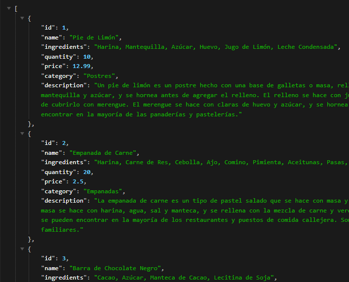

  

API de Productos
License: MIT

Bienvenido a la API de Productos. Esta API te permite realizar operaciones CRUD (Crear, Leer, Actualizar y Borrar) en una base de datos de productos. La API está alojada en Digital Ocean.

Instalación
Para utilizar esta API, necesitas tener instalado Node.js. Sigue los siguientes pasos para instalar la API en tu máquina local:

Clona este repositorio en tu máquina local.
Ejecuta npm install para instalar las dependencias.
PORT=3000
Ejecuta npm start:dev para iniciar la API.
Uso
Una vez que la API esté instalada y en ejecución, puedes utilizarla para realizar operaciones CRUD en la base de datos de productos. Para más detalles, consulta la documentación de la API.

Contribuir
Si deseas contribuir a este proyecto, por favor lee las pautas de contribución antes de hacerlo.

Licencia
Este proyecto está bajo la Licencia MIT. 